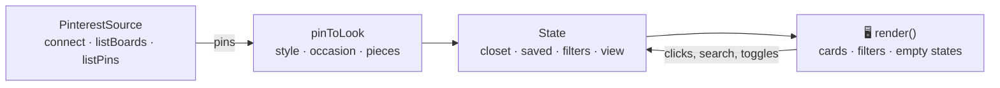

# Closet Match

**Turn your Pinterest boards into outfits, then see exactly which pieces you already own.**

&nbsp;

&nbsp;

<!-- Replace this line with a 20-second GIF: Connect Pinterest → pick boards → open a look → Why this outfit? -->

---

## The problem

People pin hundreds of outfits they love, then stand in front of a full closet with nothing to wear.

The gap isn't inspiration. It's the step between **"I love this look"** and **"I can make this from what I own, and here's what I'm missing."** Closet Match starts from the looks you've already saved and closes that gap.

## Try it in 60 seconds

1. Open the **[live demo](https://yeseniananneliza.github.io/Closet-Match/)**.
2. Click **Connect Pinterest** → **Continue with demo account**.
3. Pick your boards and click **Import**. Each pin becomes a look.
4. Notice the filters: they're already set to the styles your boards lean toward.
5. Open **Why this outfit?** on any look, then **View details** to see what you own and what's missing.
6. Switch between **Try sample closet** and **Start empty** and watch every look update.

## What it does

| | |
|---|---|
| **Boards → looks** | Pick which boards to import. Every pin becomes a look with its photo, style, occasion and pieces. |
| **Your style, detected** | The app counts the styles across your pins and pre-selects your top two. |
| **Closet matching** | Each card shows "You own 2 of 3" with a progress bar. Details split owned vs. missing pieces. |
| **Explains itself** | "Why this outfit?" names the board it came from, the style it matches, and how much of it you own. |
| **Shopping list** | Add a look's missing pieces to a shopping list in one tap. |
| **Search, filters, Saved** | Search across titles, pieces and boards; filter by style and occasion; save looks with the heart. |
| **Remembers you** | Your connection, chosen boards, closet and saved looks persist in your browser. |

## How it works

**`PinterestSource`** is the only place pins come from. Today it returns a demo account with 5 boards and 16 pins. It exposes three async methods (`connect`, `listBoards`, `listPins`), so real Pinterest data drops in without touching the rest of the app.

**`pinToLook`** turns a pin's title and description into structured data:

> *"cream silk blouse tucked into beige wide-leg trousers. minimal capsule workwear"*

| Output | Result | Because of |
|---|---|---|
| Style | Minimalist | "minimal", "capsule", "cream", "beige" |
| Occasion | Work | "workwear" |
| Pieces | Silk blouse, Wide-leg trousers | piece rules, most specific first |

- **Specific beats broad.** "linen trousers" is matched before "trousers", and each match is removed so it can't be counted twice.
- **Whole words only.** "bold" won't match inside another word.
- **Board as backup.** If a pin never names an occasion, the board it's on decides.

**State → render** is one-directional: every interaction updates a single state object, then one `render()` redraws the view. Filters, search, the Saved tab, and the closet toggle all go through the same path, so they can't drift out of sync.

## Product decisions

- **A demo account, on purpose.** Real Pinterest sign-in needs a server to keep the app secret and access tokens out of the browser, plus Pinterest's app review. Building against one small interface keeps that swap contained.
- **Start empty, not with stock photos.** Before you connect, the page shows no outfits at all. Every image you see comes from your own boards, so the looks are personal from the first screen.
- **Your boards set your style.** Instead of a style quiz, the app reads what you actually save and pre-selects it. You can still change the filters.
- **Explain every recommendation.** "Why this outfit?" shows the reasoning so people trust the matches.
- **Honest labeling.** The demo is marked "Demo account," and the footer says it isn't affiliated with Pinterest.

## Built to last

- **Zero dependencies, zero build step.** One `index.html` with vanilla JavaScript and CSS. It runs on GitHub Pages as-is and opens straight from your file system.
- **Accessible.** Dialogs trap focus and return it on close, Escape closes them, toggles use `aria-pressed`, the active tab uses `aria-current`, updates are announced with `aria-live`, every photo has hand-written alt text, and motion respects `prefers-reduced-motion`.
- **Resilient.** If a photo fails to load, the card shows the look's name on a soft tile instead of a broken image. If browser storage is blocked, the app keeps working in memory.
- **Responsive.** The header, grid and dialogs adapt from wide desktop down to phone width.

## What's next

1. **Real Pinterest sign-in** with a serverless OAuth backend proxying `GET /v5/boards` and `GET /v5/boards/{id}/pins`.
2. **Measure the tagger** on a hand-labeled set of pins it has never seen, and report accuracy for styles, occasions and pieces.
3. **Tag from the image** with a vision model, and compare it with the text rules on that same set.
4. **Use shape and undertone** in ranking. Today they're saved preferences, not yet part of matching.
5. **"One piece away"**: rank purchases by how many new looks each one unlocks.

## Run it locally

Download `index.html` and open it in your browser. That's it.

---

Built by **Yesenia Navarro** as a product case study.
Demo pin photos from [Unsplash](https://unsplash.com/?utm_source=closet_match&utm_medium=referral) under the Unsplash License. Not affiliated with Pinterest.

